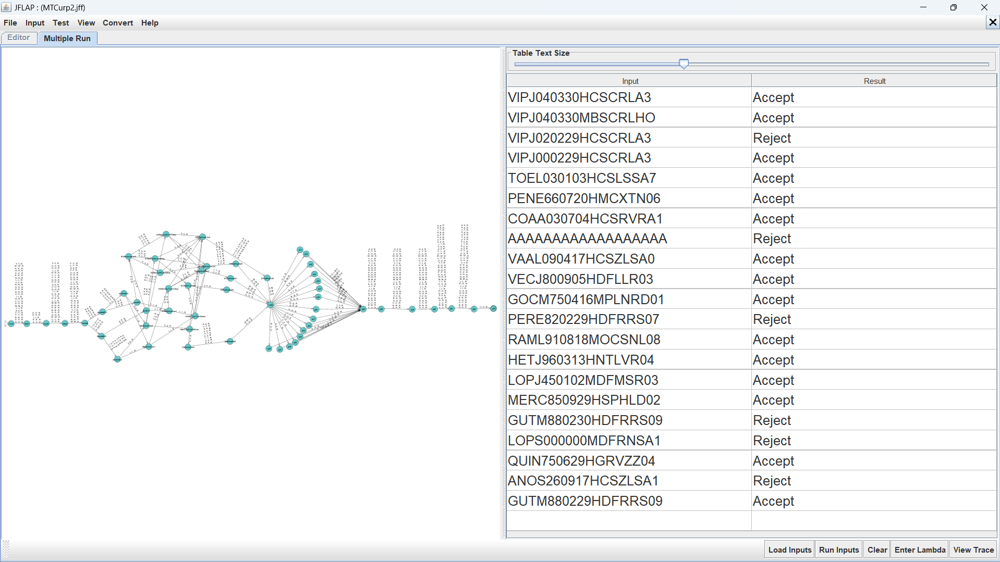

# CURP Generator

This program is a CURP (Unique Population Registry Code) generator, which is a unique identification code used in Mexico. The program has a graphical interface where users can enter:

- Full name
- Date of birth
- Sex
- State of birth

And it automatically generates the CURP code following the official Mexican rules for its construction, including extracting specific vowels and consonants from names, and adding the corresponding state codes.

## Máquina de Turing
Para entender mejor el proceso de generación del CURP, se ha implementado una máquina de Turing que puede visualizarse en el siguiente diagrama:

La máquina de Turing representa el proceso paso a paso de cómo se construye el CURP a partir de los datos ingresados, siguiendo las reglas oficiales establecidas por el gobierno mexicano.